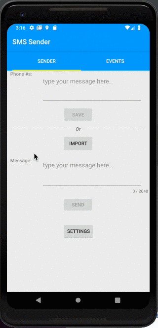

# SmsSender
ContinuesBiometrics MVVM arch SMS app

With sms sender you can import XLS,XLXS files or type list of phone numbers manually and to send a SMS message to each of your contacts. You can easily find a full log of events (sending sms, import files) where you can order events by name/date/status.

* <b>Apache POI lib</b> - XLS,XLSX Reader
* <b>RXJava2</b> - Observer Pattern
* <b>Dagger2</b> - Injection
* <b>ButterKnife</b> - View Injection
* <b>Room</b> - DB
* <b>RecyclerView</b> - List

